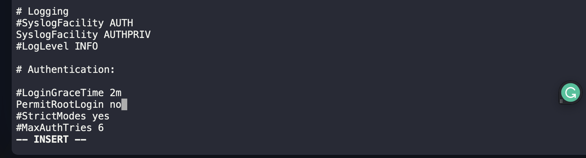

1. SSH into the App Server

```
ssh tony@stapp01
sudo su -
```

2. Modify the root user login permission to "no"

```
vi /etc/ssh/sshd_config
```



3. Restart `sshd` service

```
systemctl restart sshd
```

4. Repeat for App Servers 2 and 3