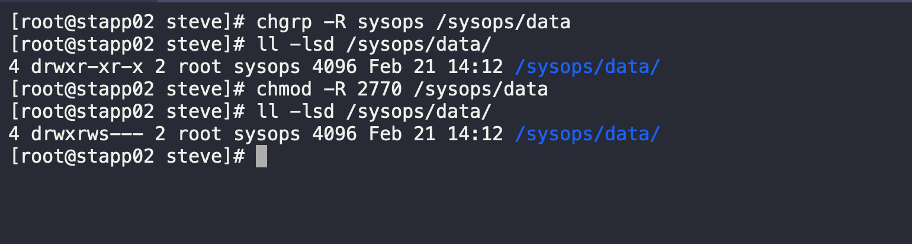

1. SSH into App Server 2

```
ssh steve@stapp02
sudo su -
```

2. Create the `sysops` directory

```
mkdir /sysops/data
```

3. Change directory group ownership to `sysops`

```
chgrp -R sysops /sysops/data
```

4. Modify the file permissions as requested

```
chmod -R 2770 /sysops/data
```
5. Validate task

```
ll -lsd /sysops/data/
```
