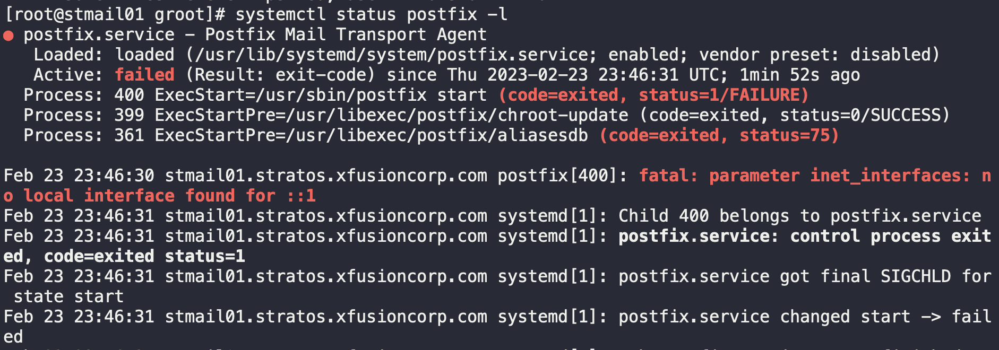
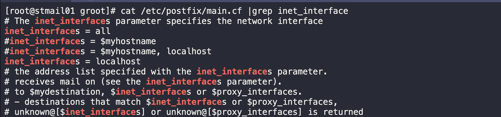
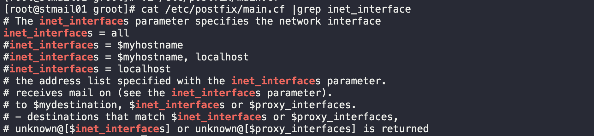
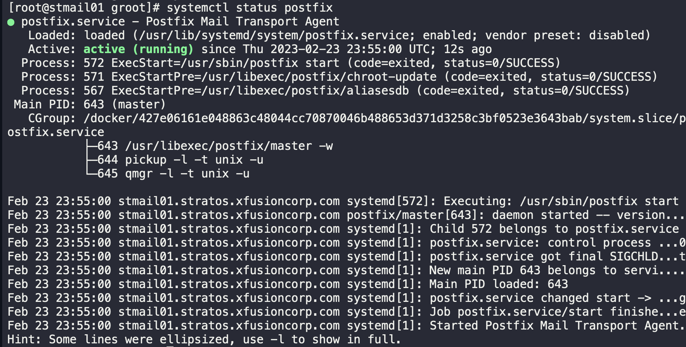
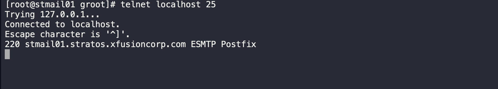

1. SSH into the Mail Server

```
ssh groot@stmail01
sudo su -
```

2. Check the status of Postfix to know the error

```
systemctl status postfix -l
```



3. With the issue identified, we proceed to solving it

```
cat /etc/postfix/main.cf |grep inet_interface
```



4. Modify the `main.cf` file to resolve the issue

```
vi /etc/postfix/main.cf
```



5. Start/restart postfix service and check its status

```
systemctl start postfix
systemctl status postfix
```



6. Validate resolution

```
telnet localhost 25
```

