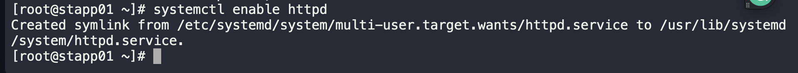
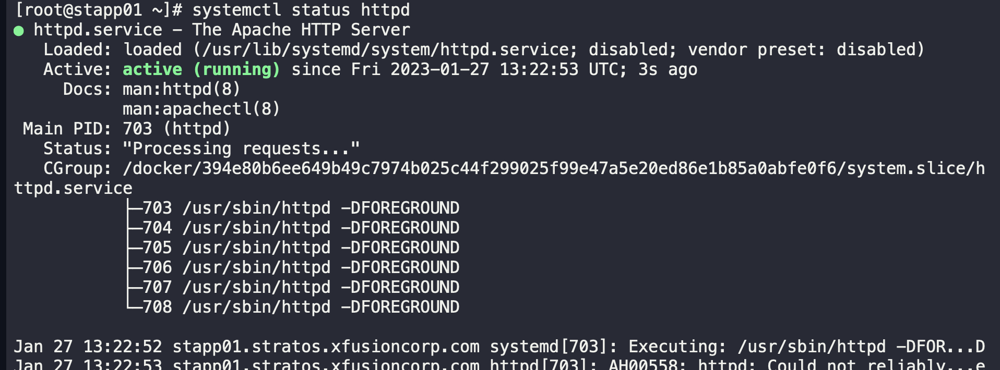

1. SSH into webserver

```
ssh tony@stapp01
sudo su -
```

2. Install nscd into appserver 

```
yum install httpd -y
```

3. Start Service and enable it to start on boot server

```
systemctl start httpd
systemctl enable httpd
systemctl status httpd
```





4. Repeat on appserver 2 and 3